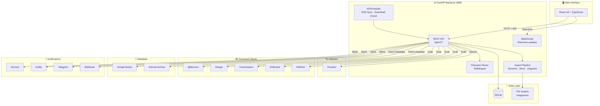
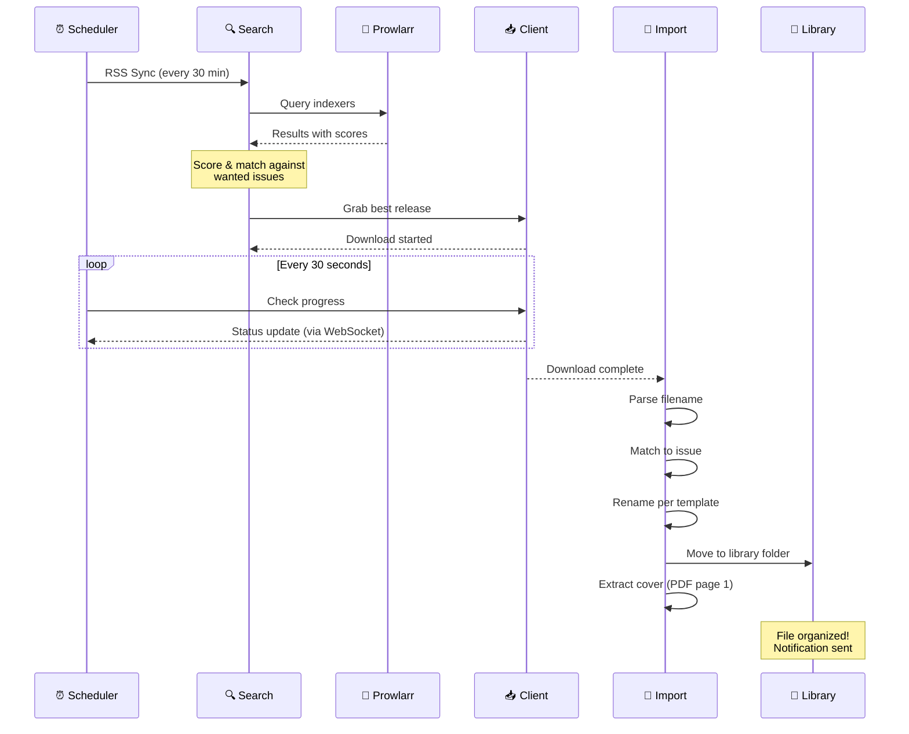

<div align="center">


[](https://github.com/sharkhunterr/pressarr/releases)
[](https://hub.docker.com/r/sharkhunterr/pressarr)
[](https://hub.docker.com/r/sharkhunterr/pressarr)
[](LICENSE)

[](https://python.org)
[](https://fastapi.tiangolo.com)
[](https://reactjs.org)
[](https://typescriptlang.org)
[](#-multi-language-support)

**[Quick Start](#-quick-start)** •
**[Features](#-features)** •
**[Docker Hub](https://hub.docker.com/r/sharkhunterr/pressarr)** •
**[Screenshots](#-screenshots)**

</div>

---

## 🚀 What is Pressarr?

Pressarr is an automated magazine collection manager for the self-hosted *arr ecosystem. It does for magazines what Sonarr does for TV shows: **monitor, search, download, rename, and organize** your periodical collection — all automatically.

**Perfect for:**
- 📚 Magazine collectors wanting automated downloads
- 🏠 Homelab enthusiasts using the *arr stack
- 📰 Anyone who wants their periodicals organized and up-to-date
- 🔮 People who want to know when the next issue drops (Calendar Forecast)

> [!WARNING]
> **Vibe Coded Project** — This application was built **100% using AI-assisted development** with [Claude Code](https://claude.ai/code).

---

## ✨ Features

<table>
<tr>
<td width="33%" valign="top">

### 📚 Magazine Library
**Full collection management**
- Search & add magazines
- Cover art & metadata
- Completion statistics
- Quality profile per title
- Batch monitoring
- File renaming templates

</td>
<td width="33%" valign="top">

### 🔮 Calendar Forecast
**Predict future issues**
- Frequency-based predictions
- Visual calendar (grid & agenda)
- Confirmed vs predicted issues
- Delayed issue detection
- 6-month lookahead

</td>
<td width="33%" valign="top">

### 🔍 Search & Download
**Fully automated pipeline**
- Prowlarr integration
- Multi-indexer support
- Quality-based scoring
- Auto-grab best release
- RSS sync every 30 min

</td>
</tr>
</table>

### 🎨 Modern Web UI
- 🌐 **2 languages** (English, French)
- 🌙 Dark theme (native)
- 📱 Fully responsive design
- ⚡ Real-time download progress via WebSocket
- 📊 History & activity tracking

### 📥 Download Clients
- **Torrent** — qBittorrent, Deluge, Transmission
- **Usenet** — SABnzbd, NZBGet
- **Direct** — Internet Archive (no client needed)

### 🔔 Notifications
Receive alerts on grab, download, import, and errors:
- **Discord** — Webhook with cover art
- **Gotify** — Self-hosted push
- **Telegram** — Bot messages
- **Webhook** — Generic HTTP endpoint

### 📂 Smart Import Pipeline
- Automatic filename parsing (multilingual: FR/EN/DE/ES/IT)
- Fuzzy title matching against known magazines
- Quality detection (TruePDF, Retail, Scan...)
- Automatic renaming & organization
- Cover extraction from PDF

### 🏗️ Metadata Sources
- **Google Books API** — Magazine metadata lookup
- **Internet Archive** — Magazine Rack collection search & direct download
- **Anna's Archive** — Additional source (optional)

---

## 🏃 Quick Start

### Docker Compose (Recommended)

```yaml
services:
  pressarr:
    image: sharkhunterr/pressarr:latest
    container_name: pressarr
    ports:
      - "8585:8585"
    volumes:
      - ./config:/config
      - ./magazines:/magazines
      - ./downloads:/downloads
    environment:
      - TZ=Europe/Paris
    restart: unless-stopped
    healthcheck:
      test: ["CMD", "curl", "-f", "http://localhost:8585/api/v1/system/status"]
      interval: 30s
      timeout: 10s
      retries: 3
```

```bash
docker compose up -d
```

**Access**: http://localhost:8585

### Docker Run

```bash
docker run -d \
  --name pressarr \
  -p 8585:8585 \
  -v $(pwd)/config:/config \
  -v $(pwd)/magazines:/magazines \
  -v $(pwd)/downloads:/downloads \
  -e TZ=Europe/Paris \
  sharkhunterr/pressarr:latest
```

---

## 🔧 Configuration

### Environment Variables

All settings can be overridden with `PRESSARR__` prefixed environment variables.

| Variable | Default | Description |
|----------|---------|-------------|
| `PRESSARR__PORT` | `8585` | Server port |
| `PRESSARR__LOG_LEVEL` | `info` | Log level (debug, info, warning, error) |
| `PRESSARR__DB_PATH` | `/config/pressarr.db` | SQLite database path |
| `PRESSARR__CONFIG_PATH` | `/config/pressarr.yml` | YAML config file path |
| `TZ` | `UTC` | Container timezone |

### First Launch

1. **Add Root Folder** — Settings → Root Folders → point to your `/magazines` volume
2. **Connect Prowlarr** — Settings → Indexers → add your Prowlarr URL & API key
3. **Add Download Client** — Settings → Download Clients → configure qBittorrent, SABnzbd, etc.
4. **Add a Magazine** — Search for a title, pick a quality profile, and start monitoring
5. **Sit back** — Pressarr will automatically search, download, rename, and organize

---

## 🎯 Service Setup

### Prowlarr (Indexers)
Search for magazine releases across all your configured indexers.

1. Open Prowlarr → Settings → General
2. Copy the **API Key**
3. In Pressarr: Settings → Indexers → Add → enter URL & API key

### Download Clients
Send grabs to your preferred download client.

| Client | Protocol | Default Port |
|--------|----------|-------------|
| qBittorrent | Torrent | 8080 |
| Deluge | Torrent | 8112 |
| Transmission | Torrent | 9091 |
| SABnzbd | Usenet | 8080 |
| NZBGet | Usenet | 6789 |

### Internet Archive
Direct downloads from the Magazine Rack collection — no download client required.

1. Settings → Metadata → Enable Internet Archive
2. Pressarr searches & downloads directly via HTTP

### Google Books (Optional)
Enriches magazine metadata with cover art, descriptions, and publisher info.

1. Get an API key from [Google Cloud Console](https://console.cloud.google.com)
2. Settings → Metadata → enter Google Books API Key

---

## 🗂️ Quality Profiles

Define which release qualities to accept and when to stop upgrading:

| Quality | Description |
|---------|-------------|
| TruePDF | Original digital PDF (best) |
| Retail | Commercial digital release |
| PDF (HQ) | High quality scan or conversion |
| PDF (LQ) | Low quality scan |
| Scan | Raw page scans |
| Unknown | Undetected quality |

Set a **cutoff** quality — Pressarr stops searching once that quality is reached, and auto-upgrades if a better quality appears.

---

## 🏗️ Architecture



### Download & Import Flow



---

## 📸 Screenshots

<details open>
<summary><b>📚 Library & Magazine Detail</b></summary>

| Magazine Library | Magazine Detail |
|------------------|-----------------|
| *Coming soon* | *Coming soon* |

</details>

<details>
<summary><b>🔮 Calendar & Search</b></summary>

| Calendar Forecast | Manual Search |
|-------------------|---------------|
| *Coming soon* | *Coming soon* |

</details>

<details>
<summary><b>⚙️ Settings</b></summary>

| Download Clients | Quality Profiles |
|-----------------|------------------|
| *Coming soon* | *Coming soon* |

</details>

---

## 🌐 Multi-Language Support

Pressarr's UI is fully translated into **2 languages**:

🇬🇧 English • 🇫🇷 Français

The filename parser additionally supports month names in **5 languages** (EN, FR, DE, ES, IT) for accurate release detection.

Change language anytime from Settings → General.

---

## 🛠️ Technology Stack

| Layer | Technologies |
|-------|--------------|
| **Backend** | Python 3.12 • FastAPI • SQLAlchemy 2.0 async • Alembic • APScheduler • PyMuPDF |
| **Frontend** | React 18 • TypeScript 5 • Tailwind CSS • Vite • shadcn/ui • TanStack Query |
| **Data** | SQLite (aiosqlite) • WebSocket real-time |
| **DevOps** | Docker (multi-stage) • Health checks |

---

## 📦 Data & Volumes

### Docker Volumes

| Path | Content |
|------|---------|
| `/config` | Database, YAML config, API key |
| `/magazines` | Organized magazine library |
| `/downloads` | Temporary download directory |

### Configuration File

Pressarr uses a YAML config file at `/config/pressarr.yml` for persistent settings. All values can be overridden by environment variables with the `PRESSARR__` prefix.

---

## 🧑‍💻 Development

### Prerequisites
- Python 3.12+
- Node.js 20+
- npm 10+

### Backend

```bash
cd backend
python3.12 -m venv .venv
source .venv/bin/activate
pip install -r requirements.txt
uvicorn app.main:app --reload --host 0.0.0.0 --port 8585
```

### Frontend

```bash
cd frontend
npm install
npm run dev
```

### Tests

```bash
cd backend
pytest tests/ -v --asyncio-mode=auto
```

### API Documentation

Once running, access the auto-generated API docs at:
- **Swagger UI**: http://localhost:8585/api/docs
- **ReDoc**: http://localhost:8585/api/redoc

---

## 🤝 Contributing

Contributions welcome! Please:

1. Fork the repository
2. Create a feature branch
3. Run linting: `ruff check .` (backend) and `npm run lint` (frontend)
4. Submit a pull request

---

## 🙏 Acknowledgments

**The Need**: Self-hosted media enthusiasts have Sonarr for TV, Radarr for movies, Lidarr for music — but nothing for magazines. Pressarr fills that gap, bringing automated magazine management to the *arr ecosystem.

**The Approach**: Built entirely through [Claude Code](https://claude.ai/code) using AI-assisted development. From database schema to responsive UI, every line was crafted through conversation.

Special thanks to the *arr community and all the homelab enthusiasts who inspired this project!

---

## 📄 License

MIT License — see [LICENSE](LICENSE) file for details.

---

<div align="center">

**Built with Claude Code 🤖 for the *arr community 📚**

[⭐ Star on GitHub](https://github.com/sharkhunterr/pressarr) • [🐛 Report Bug](https://github.com/sharkhunterr/pressarr/issues) • [💡 Request Feature](https://github.com/sharkhunterr/pressarr/issues)

</div>
